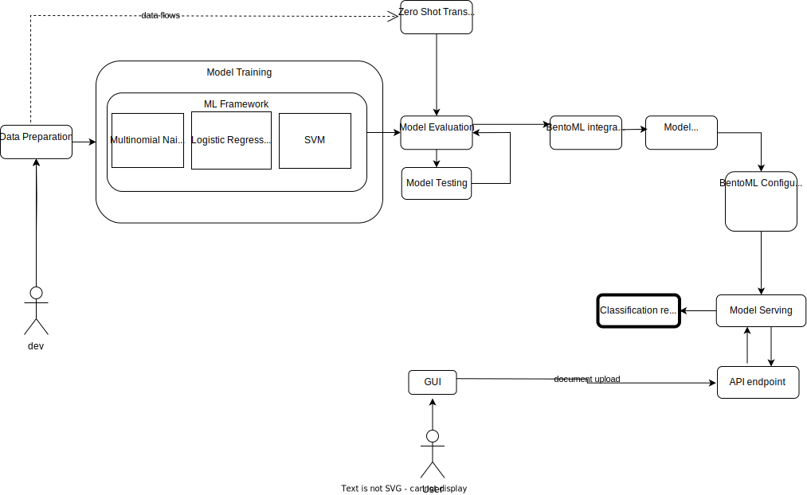

# Table of Contents
1. [Project Overview](#mlops-for-document-classification-models)
2. [Team Members](#team-members)
3. [Project Directory Structure](#project-directory-structure)
4. [Data Preparation](#data-preparation)
   - [Data Collection](#1-data-collection)
   - [Data Processing](#2-data-processing)
5. [Model Training](#model-training)
   - [Machine Learning Framework](#1-machine-learning-framework)
   - [Model Evaluation](#2-model-evaluation)
6. [Model Packaging with BentoML](#model-packaging-with-bentoml)
7. [Configuring BentoML for Data Serialization](#configuring-bentoml-for-data-serialization)
8. [Model Serving](#model-serving)
9. [Model Testing](#model-testing)
10. [Documentation and Presentation](#documentation-and-presentation)
11. [Suggested Tech Stack](#suggested-tech-stack)
12. [Repository Structure](#repository-structure)
13. [Open Issues and Milestones](#open-issues-and-milestones)
14. [Presentations](#presentations)
15. [Future Work](#future-work)

# MLOps for Document Classification Models

This project demonstrates a workflow for creating, training, packaging, and serving a document classification model, focusing on the 20 Newsgroups dataset. It incorporates machine learning and natural language processing techniques.

## UML Diagram

## Team Members
- Hogea Eduard
- Iasmina Popovici
- Diana Călina

## Project Directory Structure
Our project is organized into distinct directories, each dedicated to a specific aspect of our work. This structure enhances the project's readability and accessibility.

### Directory Layout and Contents:

#### 1. Data_Preprocessing_and_Analysis
This directory contains scripts and notebooks for initial data handling, including fetching, preprocessing, and exploratory analysis.
- `fetch_dataset.py`: Script for downloading and loading the dataset.
- `advanced_preprocess.py`: Advanced data preprocessing functions.
- `exploration.ipynb`: Jupyter notebook for data exploration and visualization.

#### 2. Feature_Engineering
Dedicated to scripts that focus on extracting and handling features from the data.
- `feature_extraction.py`: Script for extracting and managing features for model training.

#### 3. Model_Development
Houses scripts related to the development and testing of machine learning models.
- `classification_model.py`: Script for building and training the classification model.
- `zero_shot_transformer.py`: Script for implementing and experimenting with a zero-shot learning model.

#### 4. Images
Contains generated images, such as model outputs and visualizations.
- Images related to model evaluation like confusion matrices are stored here for reference and documentation purposes.

## Data Preparation

### 1. Data Collection
- **Dataset**: 20 Newsgroups dataset, including text documents and their corresponding labels.

### 2. Data Processing
- **Tools**: NLTK for text preprocessing (tokenization, removing stop words, lemmatization).
- **Current State**: Basic text preprocessing implemented in `advanced_preprocess.py`.

## Model Training

### 1. Machine Learning Framework
**Method**: Employ scikit-learn for training various classifiers for document classification.

**Models**:
* Multinomial Naive Bayes
* Logistic Regression
* Linear Support Vector Machine (SVM)

**Current State**: Model training for all three classifiers is implemented in classification_model.py. Each model is evaluated on the 20 Newsgroups dataset.

### 2. Model Evaluation
**Implementation**: The performance of each model is evaluated using two key methods.
The evaluation metrics are implemented and displayed in the classification_model.py script, with results printed to the console and confusion matrices saved as PNG files.

1. **Confusion Matrix**: Visual representation of the performance of each classifier. Separate confusion matrices are generated and saved for each model, providing insights into the true positives, false positives, false negatives, and true negatives for each class.

2. **Classification Report**: Includes precision, recall, f1-score, and support for each class. This report is generated for each classifier, providing a detailed view of their performance across different categories.

**Results**:
- **Naive Bayes**: Demonstrated moderate performance with some variance across different categories.
- **Logistic Regression**: Showed improved performance over Naive Bayes, with higher precision and recall in most categories.
- **Linear SVM**: Exhibited the best performance among the three, with high accuracy and balanced precision and recall across various classes.

### Zero Shot Transformer

#### Overview:
The Zero Shot Transformer is an integral part of our document classification project. It utilizes the Hugging Face Transformers library to perform classification tasks without labeled training data. It leverages the 'typeform/distilbert-base-uncased-mnli' model, a distilled version of BERT fine-tuned on the MultiNLI dataset, to infer the probabilities of different categories or labels for a given text. 

#### Features:
- **Zero-Shot Learning**: Employs a state-of-the-art approach to classify texts into predefined or dynamic categories without needing training data for each category.
- **Flexibility**: Supports various transformer models, allowing for custom selection based on specific project needs or constraints.
- **Ease of Use**:  Incorporated into a Tkinter GUI Application, it provides an intuitive drag-and-drop and browse functionality for easy file input and classification.
- **Efficiency**: Capable of extracting and classifying text from multiple file formats (PDF, DOCX, TXT), enhancing the workflow efficiency.

##### Prerequisites:
To use the Zero Shot Transformer Classifier, ensure the following prerequisites are met:
- Python (version 3.6 or newer)
- Hugging Face Transformers library

#### Implementation Details
The Zero Shot Classifier is implemented as a Python class, which handles the loading and utilization of the pre-trained DistilBERT model. 
This design ensures a smooth and efficient user experience.

#### Usage
Utilizing the Zero Shot Classifier involves providing the text and a selection of candidate labels. The classifier then evaluates and predicts the relevance of each label to the text, offering clear insights into the most fitting categories.
In our project, text extracted from various file formats (PDF, DOCX, TXT) is classified using the Zero Shot Classifier in a Tkinter GUI Application that provides an intuitive interface for the classifying task. Here is how to use it:
1. **Start the Application:**
- Run the script to open the Tkinter GUI window.
- The title of the window is 'Drag and Drop File Converter'. 

2. **File Input:**
- Drag and Drop: Simply drag a PDF, DOCX, or TXT file and drop it into the designated area in the GUI.
- Browse and Select: Click the "Browse" button to open a file dialog, navigate to your desired file, and select it.

3. **Automatic Text Extraction and Classification:**
- Once a file is input, the application automatically extracts the text from the file.
- The extracted text is then classified using the Zero Shot Classifier.
- The classifier is pre-configured with a diverse set of candidate labels such as "Art", "Science", "Technology", "Business", etc.

4. **Viewing the Classification Results:**
- The classification results, including the most probable category and its confidence score, are displayed in a text area within the GUI.
- For instance, if you input a news article about technology, the classifier might display a result such as "Label: Technology, Score: 0.92".

5. **Multithreaded Operation:**
- The classification task runs in a separate thread, ensuring the GUI remains responsive during the processing.

#### Benefits:
- **Enhanced Accuracy**: The Zero Shot Transformer Classifier brings unparalleled accuracy to our document classification tasks, ensuring precise categorization even in complex scenarios.
- **Scalability and Adaptability**: Its ability to adapt to a wide range of text types and categories makes it an indispensable tool in our ever-evolving project landscape.
- **Innovative Edge**: Employing this state-of-the-art technology positions our project at the forefront of NLP innovation, granting us a competitive edge in the field.
- **Data Privacy and Compliance**: The zero-shot approach significantly mitigates data privacy concerns, as it negates the necessity for large, potentially sensitive training datasets.

## Model Packaging with BentoML
### Overview
In our project, we utilize BentoML for efficient model packaging and serving. BentoML is an open-source framework that simplifies model serving, making it easier to deploy machine learning models into production.

### Features
- **Efficient Model Serving**: BentoML provides a streamlined approach for serving models, handling requests efficiently with built-in support for batching and micro-batching.
- **Flexible Data Handling**: With support for various data formats, BentoML makes it easy to process inputs and outputs in different formats like JSON, images, and Numpy arrays.
- **Adaptive Model Runners**: BentoML's runners allow for optimized model inference, handling concurrency and resource management effectively.

###  Prerequisites
- **Python Environment**: A Python environment with BentoML and its dependencies installed.
- **Model and Data**: Pre-trained model files and data processing scripts compatible with BentoML's framework.

### Implementation details
In our implementation, we use the service.py script, which plays a critical role in defining and configuring the BentoML service.
- **Service Definition**: The service.py script defines a BentoML service named zero_shot_classifier_service. This service is tailored to our specific model, handling inference requests and managing data serialization.
- **Data Serialization Configuration**: We configure the service to handle JSON and Numpy array data formats, ensuring compatibility with our model's input and output specifications.

## Configuring BentoML for Data Serialization
Data serialization is a critical component in machine learning services, determining how data is converted into a format suitable for transmission over a network and then deserialized back into a usable format. In our project, we have configured BentoML to handle this process efficiently, ensuring that our model can interpret the incoming data correctly and that the outputs are in a user-friendly format.

### Key Components in Data Serialization Configuration:
- **Data Format Selection**
We have configured our BentoML service to accept inputs in JSON and Numpy array formats. JSON is used for its simplicity and ubiquity in web applications, while Numpy arrays are essential for numerical data typically used in machine learning models.
- **Utilizing BentoML's Serialization Tools**
BentoML offers a variety of serialization tools such as bentoml.io.JSON and bentoml.io.NumpyNdarray. These tools make it easy to define the expected input and output formats for the model.
- **Input and Output Configuration**
n the service.py file, we configure our model to receive inputs in the specified formats. For instance, a client can send a JSON object, which BentoML will deserialize into a Python object for the model to process. Similarly, the model's output is serialized back into the chosen format (JSON or Numpy array) before being sent back to the client.

### Benefits of our approach 
- **Flexibility and Compatibility**:  By supporting multiple data formats, our service can easily integrate with various client applications, making it more versatile.
- **Efficiency**: With BentoML's built-in serialization tools, the conversion process is streamlined, reducing overhead and improving response times.
- **Ease of Use**: This setup simplifies the process for end-users or client applications, as they can interact with our service using familiar data formats.
- **Consistent API**: The standardized API format of BentoML ensures a consistent interface for model serving, simplifying integration with different systems.

## Usage
- When sending a request to our service, clients need to ensure that the data is in the correct format (either JSON or Numpy array).
- The service will automatically handle the serialization and deserialization processes, allowing the model to process the data and return the results seamlessly.

## Model Serving
- **Note**: Future scope for setting up a BentoML server and creating an API endpoint.

## Model Testing
- **Note**: Future scope for developing a Python client for model testing and verification.

## Documentation and Presentation
- **Current State**: Basic documentation provided. Comprehensive documentation and presentation are part of future work.

## Suggested Tech Stack
- **Programming Language**: Python
- **NLP Libraries**: NLTK (current), spaCy (future)
- **ML Libraries**: scikit-learn
- **Model Packaging and Serving**: BentoML (future)
- **Client for Testing**: Python client (future)

## Open Issues and Milestones
- **Issue 9**: Development of a Python Client for Document Handling and API Interaction. Milestone 3 (Deadline: 09.01.2024).
- **Issue 8**: Preparation for Upcoming Presentation on 28.11. Milestone 1 (Deadline: 28.11.2023).
- **Issue 7**: GitHub Repository Organization and Issue Management. Milestone 1 (Deadline: 28.11.2023).
- **Issue 6**: Update and Refine README Documentation. Milestone 1 (Deadline: 28.11.2023).
- **Issue 5**: Using BentoML for Testing Different Linear Models. Milestone 2 (Deadline: 12.12.2023).
- **Issue 4**: Integration of BentoML for API Endpoint for JSON Documents. Milestone 3 (Deadline: 09.01.2024).
- **Issue 3**: Development of Comprehensive Unit Tests. Milestone 3 (Deadline: 09.01.2024).
- **Issue 2**: Integration of BentoML for Server and Data Serialization. Milestone 2 (Deadline: 12.12.2023).
- **Issue 1**: Integrate Zero Shot Classifier with Transformer. Milestone 2 (Deadline: 12.12.2023).

## Presentations
- **Milestone 1 Presentation** (Deadline: 28.11.2023): [View Presentation](https://docs.google.com/presentation/d/1ViKHCMRyTVjxCQlsLhDuiJC7XtjG7_u1FhZ6M06_4JU/edit?usp=sharing)
- **Milestone 2 Presentation** (Deadline: 12.12.2023): [View Presentation](https://docs.google.com/presentation/d/1xVbAxn8igkAqN0FpJJ7Ypyx6f0Dw2WGvtSc2nfSI5uE/edit#slide=id.g2a602b6ec67_0_0)
- **Milestone 3 Presentation** (Deadline: 09.01.2024): *Link to be provided*
- **Final Project Presentation**: *Link to be provided*

## Future Work
- Expand the use of NLP libraries like spaCy.
- Integrate BentoML for model packaging and serving.
- Develop a Python client for model testing.
- Enhance documentation and prepare for project presentation.

