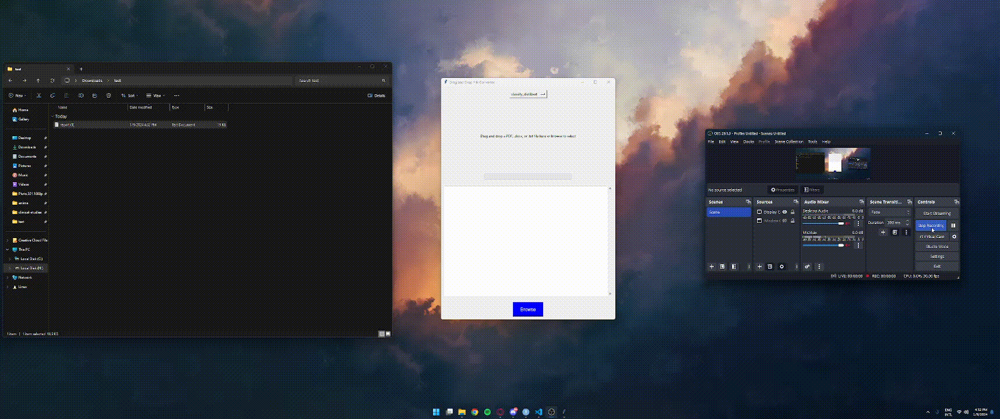

# Table of Contents
<!-- TOC start -->
- [MLOps for Document Classification Models](#mlops-for-document-classification-models)
   * [UML Diagram](#uml-diagram)
   * [Results](#results)
   * [Team Members](#team-members)
   * [Project Directory Structure](#project-directory-structure)
      + [Directory Layout and Contents:](#directory-layout-and-contents)
         - [1. Data_Preprocessing_and_Analysis](#1-data_preprocessing_and_analysis)
         - [2. Feature_Engineering](#2-feature_engineering)
         - [3. Model_Development](#3-model_development)
         - [4. Model_Testing](#4-model_testing)
         - [5. Images](#5-images)
   * [Data Preparation](#data-preparation)
      + [1. Data Collection](#1-data-collection)
      + [2. Data Processing](#2-data-processing)
         - [Example Usage:](#example-usage)
   * [Model Training](#model-training)
   * [Model Training](#model-training-1)
      + [1. Machine Learning Framework](#1-machine-learning-framework)
      + [Implementation Details](#implementation-details)
         - [Key Features:](#key-features)
         - [Usage Example:](#usage-example)
      + [2. Model Evaluation](#2-model-evaluation)
         - [Evaluation Methods:](#evaluation-methods)
         - [Visualizing Model Performance:](#visualizing-model-performance)
      + [Accuracies of ML Models Using Different Embeddings](#accuracies-of-ml-models-using-different-embeddings)
      + [Conclusion](#conclusion)
      + [Zero Shot Transformer](#zero-shot-transformer)
         - [Overview](#overview)
         - [Features](#features)
         - [Getting Started](#getting-started)
      + [Usage](#usage)
         - [File Input Options:](#file-input-options)
         - [Text Classification:](#text-classification)
         - [View Results:](#view-results)
      + [Benefits](#benefits)
   * [Model Packaging and Serving with BentoML](#model-packaging-and-serving-with-bentoml)
      + [Overview](#overview-1)
      + [Features](#features-1)
      + [Prerequisites](#prerequisites)
      + [Implementation Details](#implementation-details-1)
   * [Model Testing](#model-testing)
         - [**Overview**: ](#overview-2)
         - [**Features**:](#features-2)
         - [Unit Tests:](#unit-tests)
   * [Open Issues and Milestones](#open-issues-and-milestones)
   * [Presentations](#presentations)
   * [Future Work](#future-work)

<!-- TOC end -->


<!-- TOC --><a name="mlops-for-document-classification-models"></a>
# MLOps for Document Classification Models

This project demonstrates a workflow for creating, training, packaging, and serving a document classification model, focusing on the 20 Newsgroups dataset. It incorporates machine learning and natural language processing techniques.

<!-- TOC --><a name="uml-diagram"></a>
## UML Diagram





<!-- TOC --><a name="results"></a>
## Results
Transformers performance without finetuning for zero-shot classification:


| Class/Model                  | DistilBERT | MobileBERT | SqueezeBERT |
|------------------------------|------------|------------|-------------|
| Overall Accuracy             | 0.1480     | **0.1507** | 0.0514      |
| alt.atheism                  | 0.0450     | **0.2605** | 0.0096      |
| comp.graphics                | 0.2865     | **0.3047** | 0.0312      |
| comp.os.ms-windows.misc      | 0.0792     | **0.1636** | 0.1530      |
| comp.sys.ibm.pc.hardware     | 0.2358     | 0.0440     | **0.3161**  |
| comp.sys.mac.hardware        | 0.0782     | **0.1914** | 0.0135      |
| comp.windows.x               | 0.0716     | **0.1714** | 0.0026      |
| misc.forsale                 | 0.1963     | **0.4503** | 0.0681      |
| rec.autos                    | 0.0800     | 0.0667     | **0.0000**  |
| rec.motorcycles              | 0.3057     | **0.2772** | 0.0311      |
| rec.sport.baseball           | 0.2219     | 0.1018     | **0.0235**  |
| rec.sport.hockey             | 0.1615     | 0.0590     | **0.0000**  |
| sci.crypt                    | 0.1553     | 0.1000     | **0.0026**  |
| sci.electronics              | 0.1097     | **0.1358** | 0.0000      |
| sci.med                      | 0.0759     | **0.1257** | 0.0131      |
| sci.space                    | 0.1270     | **0.1429** | 0.0000      |
| soc.religion.christian       | 0.2604     | **0.1823** | 0.0417      |
| talk.politics.guns           | 0.2571     | 0.0593     | **0.0056**  |
| talk.politics.mideast        | 0.0568     | 0.0541     | **0.0027**  |
| talk.politics.misc           | 0.0198     | 0.0297     | **0.3333**  |
| talk.religion.misc           | 0.0571     | 0.0408     | **0.0082**  |
| **Execution Time (seconds)** | **1357.23**| 5155.22    | 4096.76     |


Transformers efficiency score. More parameters seem to not always indicate a better performing model:
| Model       | Overall Accuracy | Parameters (Millions) | Efficiency Score |
|-------------|------------------|-----------------------|------------------|
| DistilBERT  | 0.1480           | 66                    | 2.24             |
| MobileBERT  | 0.1507           | 25                    | 6.03             |
| SqueezeBERT | 0.0514           | 51                    | 1.01             |


Assessing the differences in accuracies of different ML models and embeddigs:
| Model                   | TF-IDF Accuracy | Word2Vec Accuracy | BERT Accuracy |
|-------------------------|-----------------|-------------------|---------------|
| Logistic Regression     | 0.6785          | 0.4753            | 0.6021        |
| SVM                     | 0.6796          | 0.4446            | 0.4164        |
| Multinomial Naive Bayes | 0.6764          | N/A               | N/A           |

Transformers performance after finetuing for zero-shot classiication:
| Model       | Initial Accuracy (%) | Fine-Tuned Accuracy (%) |
|-------------|----------------------|-------------------------|
| DistilBERT  | 14.80                | 72.89                   |
| MobileBERT  | 15.07                | 66.73                   |
| SqueezeBERT | 5.14                 | 71.35                   |


<!-- TOC --><a name="team-members"></a>
## Team Members
- Hogea Eduard
- Iasmina Popovici
- Diana Călina

<!-- TOC --><a name="project-directory-structure"></a>
## Project Directory Structure
Our project is organized into distinct directories, each dedicated to a specific aspect of our work. This structure enhances the project's readability and accessibility.

<!-- TOC --><a name="directory-layout-and-contents"></a>
### Directory Layout and Contents:

<!-- TOC --><a name="1-data_preprocessing_and_analysis"></a>
#### 1. Data_Preprocessing_and_Analysis
This directory contains scripts and notebooks for initial data handling, including fetching, preprocessing, and exploratory analysis.
- [fetch_dataset.py](Data_Preprocessing_and_Analysis%2Ffetch_dataset.py): Script for downloading and loading the dataset.
- [advanced_preprocess.py](Data_Preprocessing_and_Analysis%2Fadvanced_preprocess.py): Advanced data preprocessing functions.
- [exploration.ipynb](Data_Preprocessing_and_Analysis%2Fexploration.ipynb): Jupyter notebook for data exploration and visualization.

<!-- TOC --><a name="2-feature_engineering"></a>
#### 2. Feature_Engineering
Dedicated to scripts that focus on extracting and handling features from the data.
- [feature_extraction.py](Feature_Engineering%2Ffeature_extraction.py): Script for extracting and managing features for model training.

<!-- TOC --><a name="3-model_development"></a>
#### 3. Model_Development
Houses scripts related to the development and testing of machine learning models.
- [classification_model.py](Model_Development%2Fclassification_model.py): Script for building and training the classification model.
- [zero_shot_transformer.py](Model_Development%2Fzero_shot_transformer.py): Script for implementing and experimenting with a zero-shot learning model.
- [service.py](Model_Development%2Fservice.py): Script that serves as the core component for creating and deploying a machine learning model using BentoML. 
It includes a `ZeroShotClassifier` class, enabling zero-shot text classification using Hugging Face's transformers, and defines an API endpoint for model inference. 
This API endpoint validates input data, classifies text against candidate labels, and returns classification results. By utilizing `service.py`, we provide an accessible 
and efficient means to serve our machine learning model, making it ready for integration into various applications.
<!-- TOC --><a name="4-model_testing"></a>
#### 4. Model_Testing
- [test_advanced_preprocess.py](Model_Testing%2Ftest_advanced_preprocess.py)
- [test_classification_model.py](Model_Testing%2Ftest_classification_model.py)
- [test_feature_extraction.py](Model_Testing%2Ftest_feature_extraction.py)
- [test_fetch_dataset.py](Model_Testing%2Ftest_fetch_dataset.py)
- [test_service.py](Model_Testing%2Ftest_service.py)
<!-- TOC --><a name="5-images"></a>
#### 5. Images
Contains generated images, such as model outputs and visualizations.
- Images related to model evaluation like confusion matrices are stored here for reference and documentation purposes.


<!-- TOC --><a name="data-preparation"></a>
## Data Preparation

<!-- TOC --><a name="1-data-collection"></a>
### 1. Data Collection
- **Dataset**: 20 Newsgroups dataset, including text documents and their corresponding labels. The dataset is a collection of approximately 20,000 newsgroup documents, partitioned (nearly) evenly across 20 different newsgroups. It's widely used for experiments in text applications of machine learning techniques, such as text classification and text clustering.

```python
from sklearn.datasets import fetch_20newsgroups

# Specify the categories if you want a subset, else load all categories
categories = ['alt.atheism', 'soc.religion.christian',
              'comp.graphics', 'sci.med']

# Load the training data
newsgroups_train = fetch_20newsgroups(subset='train',
                                      categories=categories,
                                      remove=('headers', 'footers', 'quotes'))

# Load the test data
newsgroups_test = fetch_20newsgroups(subset='test',
                                     categories=categories,
                                     remove=('headers', 'footers', 'quotes'))
```


<!-- TOC --><a name="2-data-processing"></a>
### 2. Data Processing

- **Tools**: We utilize the NLTK library for in-depth text preprocessing. This step is crucial for enhancing model performance by cleaning and standardizing the text data.

- **Current State**: Our project implements basic to advanced text preprocessing functionalities in `advanced_preprocess.py`. The script is designed to refine text data through several stages:

    - **Lowercasing**: All text is converted to lowercase to ensure consistency across the dataset.
    - **Removing Non-Alphabetic Characters**: We strip out numbers, punctuation, and special characters, focusing solely on alphabetic characters to maintain the relevance of our textual analysis.
    - **Tokenization**: The text is broken down into individual words or tokens. This is a preparatory step for more targeted preprocessing tasks.
    - **Removing Stopwords**: Common words that offer little value in understanding the text's context, such as "the", "is", and "and", are removed.
    - **Lemmatization**: Words are reduced to their base or dictionary form, aiding in the consolidation of similar forms of a word.

<!-- TOC --><a name="example-usage"></a>
#### Example Usage:

To demonstrate the functionality of `advanced_preprocess.py`, consider the following example:

```python
from advanced_preprocess import advanced_preprocess_text

sample_text = "The quick brown fox jumps over the lazy dog. It was a great sight to see!"
preprocessed_text = advanced_preprocess_text(sample_text)

print("Original Text:", sample_text)
print("Preprocessed Text:", preprocessed_text)
```

<!-- TOC --><a name="model-training"></a>
## Model Training

<!-- TOC --><a name="model-training-1"></a>
## Model Training

<!-- TOC --><a name="1-machine-learning-framework"></a>
### 1. Machine Learning Framework

**Method**: We employ scikit-learn, a powerful and flexible machine learning library, for training various classifiers for document classification tasks. This approach allows us to leverage scikit-learn's efficient implementations of several popular algorithms.

**Models**:
* **Multinomial Naive Bayes**: A suitable choice for text classification tasks where features (words) are categorical.
* **Logistic Regression**: Offers robustness and simplicity, especially for binary classification problems.
* **Linear Support Vector Machine (SVM)**: Known for its effectiveness in high-dimensional spaces, making it ideal for text classification.

**Current State**: Model training for all three classifiers is implemented in `classification_model.py`. This script automates the process of training each model on the 20 Newsgroups dataset and evaluates their performance.

<!-- TOC --><a name="implementation-details"></a>
### Implementation Details

The `classification_model.py` module includes functions for training models and plotting confusion matrices to assess their performance visually. It leverages the `fetch_20newsgroups` function from scikit-learn to load the dataset and the `extract_features` function from our Feature Engineering module to prepare the data for training.

<!-- TOC --><a name="key-features"></a>
#### Key Features:

- **Data Preparation**: Uses TF-IDF vectorization for feature extraction, transforming text documents into a format suitable for model training.
- **Model Training**: Supports training Multinomial Naive Bayes, Logistic Regression, and Linear SVC models with a simple function call.
- **Evaluation**: Employs classification report and confusion matrix to provide insights into model performance across different categories.

<!-- TOC --><a name="usage-example"></a>
#### Usage Example:

```python
# Example: Training a Naive Bayes Classifier
from classification_model import train_model, plot_confusion_matrix
from sklearn.datasets import fetch_20newsgroups

# Load the dataset
newsgroups_train = fetch_20newsgroups(subset='train', remove=('headers', 'footers', 'quotes'))
docs = newsgroups_train.data
lbls = newsgroups_train.target

# Train the Naive Bayes model
nb_model, _, y_test_nb, nb_predictions = train_model(docs, lbls, "naive_bayes")

# Plot and save the confusion matrix
categories = newsgroups_train.target_names
plot_confusion_matrix(y_test_nb, nb_predictions, categories, "confusion_matrix_naive_bayes.png")
```


<!-- TOC --><a name="2-model-evaluation"></a>
### 2. Model Evaluation

**Implementation**: We assess each model's performance through comprehensive evaluation metrics, as implemented in the `classification_model.py` script. The outcomes of these evaluations are not only printed to the console for immediate review but are also visually represented through confusion matrices, saved as PNG files for a more in-depth analysis.

<!-- TOC --><a name="evaluation-methods"></a>
#### Evaluation Methods:

1. **Confusion Matrix**: Acts as a foundational visual tool for understanding a classifier's performance. For each model, we generate and save a separate confusion matrix. This matrix helps us identify not just the model's accuracy but also provides insights into the types of errors it makes, including:
   - **True Positives (TP)**: Correctly predicted positive observations.
   - **False Positives (FP)**: Incorrectly predicted positive observations.
   - **True Negatives (TN)**: Correctly predicted negative observations.
   - **False Negatives (FN)**: Incorrectly predicted negative observations.
   
   By analyzing these matrices, we gain a nuanced understanding of each model's predictive behavior across the various classes.

2. **Classification Report**: This report complements the confusion matrix by quantifying the precision, recall, f1-score, and support for each class. Precision tells us the accuracy of positive predictions, recall gives the fraction of positives that were correctly identified, and the f1-score provides a balance between precision and recall. The support indicates the number of actual occurrences of each class in the dataset. This detailed breakdown allows for a granular assessment of model performance across different categories, highlighting areas where the model excels or struggles.

<!-- TOC --><a name="visualizing-model-performance"></a>
#### Visualizing Model Performance:

Each model's confusion matrix is saved in the "Images" directory. These visual aids are invaluable for presentations or reports, allowing stakeholders to quickly grasp the strengths and weaknesses of the deployed models. For example, confusion matrices can highlight if a model is particularly good at identifying certain categories while struggling with others, guiding future improvements or adjustments in model selection.

<!-- TOC --><a name="accuracies-of-ml-models-using-different-embeddings"></a>
### Accuracies of ML Models Using Different Embeddings

| Model                   | TF-IDF Accuracy | Word2Vec Accuracy | BERT Accuracy |
|-------------------------|-----------------|-------------------|---------------|
| Logistic Regression     | 0.6785          | 0.4753            | 0.6021        |
| SVM                     | 0.6796          | 0.4446            | 0.4164        |
| Multinomial Naive Bayes | 0.6764          | N/A               | N/A           |

<!-- TOC --><a name="conclusion"></a>
### Conclusion

The evaluation of machine learning models using different embeddings has provided us with valuable insights into the comparative strengths of each model and embedding combination. It's evident from the table above that the choice of embedding significantly influences the model performance, with TF-IDF generally leading to the highest accuracies across the models tested.

- **Logistic Regression** and **SVM** models exhibit competitive performance with TF-IDF embeddings, suggesting that traditional statistical features still hold strong predictive power for text classification tasks. Interestingly, Logistic Regression shows a notable increase in performance when utilizing BERT embeddings, underscoring the potential of leveraging contextual embeddings for improving model accuracy in complex classification scenarios.

- The absence of Word2Vec and BERT accuracies for the **Multinomial Naive Bayes** model was quite frustrating, but given it's nature we realized it was not compatible.


<!-- TOC --><a name="zero-shot-transformer"></a>
### Zero Shot Transformer

<!-- TOC --><a name="overview"></a>
#### Overview
The Zero Shot Transformer is a cornerstone of our document classification framework, designed to capitalize on the versatility and power of the Hugging Face Transformers library. Recognizing that the project's scope did not limit the kinds of documents to be classified, we embraced the opportunity to employ a zero-shot learning approach. This method enables the classification of texts into a wide array of categories, including those not seen during training, by leveraging three distinct transformer models:
- `distilbert-base-uncased-mnli`
- `mobilebert-uncased-mnli`
- `squeezebert-mnli`

This approach allows our classifier to process and categorize virtually any text, showcasing an unparalleled flexibility in handling diverse and dynamically evolving classification tasks.

<!-- TOC --><a name="features"></a>
#### Features
- **Universal Classification**: By integrating zero-shot learning, our classifier can categorize texts into any predefined or newly introduced category, eliminating the need for category-specific training data.
- **Model Diversity**: The inclusion of multiple transformer models (`DistilBERT`, `MobileBERT`, and `SqueezeBERT`) enhances our classifier's adaptability, allowing for optimal model selection based on specific project needs or performance criteria.
- **User Accessibility**: Integrated into a Tkinter GUI Application, our system offers an effortless file input mechanism through drag-and-drop and browsing functionalities, making it accessible to users with varied technical expertise.
- **Comprehensive Text Support**: Our classifier is adept at processing text from numerous file formats, including PDF, DOCX, and TXT, significantly improving workflow efficiency and user experience.
  
<!-- TOC --><a name="getting-started"></a>
#### Getting Started
To begin utilizing the Zero Shot Classifier, users are required to first clone this repository. Following the repository clone, navigate to the `Model_Development` directory and initiate the BentoML service with the command:

```bash
cd Model_Development
bentoml serve service:svc
```

Concurrently, in a separate terminal, activate the GUI application:

```
python gui.py
```


These steps will launch the classification service and the graphical user interface, enabling users to easily classify documents with the Zero Shot Transformer.

<!-- TOC --><a name="usage"></a>
### Usage
- **Launch the Application**: Start the Tkinter GUI, named 'Drag and Drop File Converter', by running `gui.py`.
  
<!-- TOC --><a name="file-input-options"></a>
#### File Input Options:
- **Drag and Drop**: Directly drag a file (PDF, DOCX, TXT) into the GUI's designated area.
- **Browse and Select**: Click "Browse" to select a file via a dialog window.

<!-- TOC --><a name="text-classification"></a>
#### Text Classification:
- Upon file selection, the application automatically extracts and classifies the text, utilizing the Zero Shot Classifier equipped with diverse candidate labels.

<!-- TOC --><a name="view-results"></a>
#### View Results:
- The GUI displays classification results, indicating the most appropriate category and confidence level for the analyzed text.

<!-- TOC --><a name="benefits"></a>
### Benefits
- **Versatility**: Our Zero Shot Transformer's capability to classify a broad spectrum of documents, even those belonging to previously unseen classes, sets a new standard in document classification.
- **Adaptability**: The choice among three transformer models ensures that our classifier remains efficient and effective across various scenarios and text complexities.
- **Innovation at the Forefront**: Implementing state-of-the-art zero-shot learning technology places our project at the leading edge of NLP innovation, offering significant advantages in document classification tasks.
- **Enhanced Data Privacy**: The zero-shot approach addresses potential data privacy concerns by negating the need for extensive, category-specific training datasets.


<!-- TOC --><a name="model-packaging-and-serving-with-bentoml"></a>
## Model Packaging and Serving with BentoML

<!-- TOC --><a name="overview-1"></a>
### Overview
In this project, BentoML serves as the cornerstone for model packaging and serving, enabling us to deploy our Zero Shot Transformer models into production seamlessly. BentoML, an open-source framework, excels in simplifying the deployment process of machine learning models, thanks to its comprehensive support for various model frameworks and data formats.

<!-- TOC --><a name="features-1"></a>
### Features
- **Efficient Model Serving**: Leveraging BentoML, we've streamlined our model serving processes, ensuring efficient handling of inference requests with support for batching and micro-batching techniques.
- **Flexible Data Handling**: BentoML's versatility in data format support allows our service to process inputs and outputs across a wide range of formats, including JSON, images, and Numpy arrays, facilitating smooth integration with different client applications.
- **Adaptive Model Runners**: With BentoML's model runners, our service benefits from optimized model inference capabilities, efficiently managing concurrency and resource allocation to meet demand.

<!-- TOC --><a name="prerequisites"></a>
### Prerequisites
- A Python environment equipped with BentoML and its dependencies, ensuring all necessary tools are available for model serving.
- Pre-trained models and data processing scripts, formatted and ready for deployment through BentoML's framework.

<!-- TOC --><a name="implementation-details-1"></a>
### Implementation Details
Our implementation hinges on the `service.py` script, which is instrumental in defining and configuring the BentoML service for our Zero Shot Classifier, capable of employing different transformer models like `distilbert-base-uncased-mnli`, `mobilebert-uncased-mnli`, and `squeezebert-mnli`.

- **Service Definition**: The `service.py` script establishes a BentoML service named `multi_model_classifier_service`, designed specifically for our Zero Shot Classification needs. This service adeptly manages inference requests, ensuring data is correctly serialized and deserialized for model processing.
- **Data Serialization Configuration**: We've configured our BentoML service to adeptly handle JSON and Numpy array data formats. This setup guarantees that inputs are correctly interpreted by our model, and outputs are returned in a format accessible to end-users.


<!-- TOC --><a name="model-testing"></a>
## Model Testing
<!-- TOC --><a name="overview-2"></a>
#### **Overview**: 
Unit testing is an essential practice in software development that involves testing individual components or units of code in isolation to ensure they work correctly. 
In our project, we have implemented unit tests to validate the functionality of various modules and scripts.
<!-- TOC --><a name="features-2"></a>
#### **Features**:
* **Assertions**: Assertions are essential for defining expected behavior and verifying whether the actual results match the expected results. They are the core of unit testing and help identify issues quickly.
* **Test Case Isolation**: Ensuring that each test case runs independently is crucial. It prevents interference between tests and helps pinpoint the exact cause of failures, making debugging easier.
* **Test Coverage Analysis**: Test coverage analysis helps track which parts of the code are exercised by the tests. It ensures that the tests adequately cover the code, increasing confidence in its correctness.
##### 
In our project, we have adopted a comprehensive unit testing strategy. We have created unit tests for various modules, scripts, and components, including data fetching, preprocessing, feature extraction, and model training. 
Each unit test is designed to validate the correctness and functionality of a specific aspect of our project. Our unit testing approach ensures the reliability and correctness of our project's various components, contributing to its overall robustness and quality.
<!-- TOC --><a name="unit-tests"></a>
#### Unit Tests:
* ***test_fetch_dataset.py***: This unit test is designed to ensure the correctness of the dataset fetching process. It verifies whether the script fetch_dataset.py is able to download and load the dataset correctly. 
The test fetches a small sample of the 20 Newsgroups dataset and checks if it contains the expected number of documents and labels.

* ***advanced_preprocess.py***: The unit test for advanced_preprocess.py focuses on testing the advanced data preprocessing functions. These functions are crucial for text cleaning, tokenization, stop word removal, and lemmatization. 
The test input includes sample text data, and it verifies whether the preprocessing functions correctly clean and process the text, resulting in expected tokens.

* ***feature_extraction.py***: This unit test is dedicated to feature_extraction.py, which is responsible for extracting TF-IDF features from text data. It checks if the feature extraction process produces the expected feature matrix and vectorizer based on a small sample of input documents.

* ***test_classification_model.py***: This unit test is dedicated to classification_model.py, which contains scripts for building and training classification models, such as Multinomial Naive Bayes, Logistic Regression, and Linear SVM. 
It evaluates the performance of these models on a small subset of the 20 Newsgroups dataset and checks key metrics like precision, recall, and accuracy.

* ***test_service.py***: This unit test is designed to validate the correctness and functionality of the service.py script. It defines and configures the BentoML service, ensuring efficient model serving and data serialization. 
Tests the service's ability to handle requests efficiently, process inputs and outputs in different formats, and ensure optimized model inference.

* ***test_zero_shot.py***: This unit test validates the Zero Shot Transformer Classifier's functionality. It tests the initialization, ensuring the model loads correctly, verifies the classifier's ability to accurately process text and candidate labels, and checks the model's save and load capabilities for consistency and reliability.

## Test Coverage Report


Our project ensures quality and robustness through comprehensive testing. Below is the latest test coverage report, which reflects our commitment to maintaining high standards in our codebase.

### Coverage Summary:

- **Total Statements**: 211
- **Total Misses**: 50
- **Total Coverage**: 76%

### Coverage Detail:

- `Data_Preprocessing_and_Analysis/advanced_preprocess.py`: 85%
- `Data_Preprocessing_and_Analysis/fetch_dataset.py`: 86%
- `Feature_Engineering/feature_extraction.py`: 78%
- `Model_Development/classification_model.py`: 75%
- `Model_Development/service.py`: 83%
- `Model_Development/zero_shot_transformer.py`: 63%
-----------------------------------------------------
TOTAL: 76% of our coode has Unit Test coverage
-----------------------------------------------------

It's clear that while some modules like `fetch_dataset.py` are well-tested, others like `zero_shot_transformer.py` require further attention to enhance their test coverage.


<!-- TOC --><a name="open-issues-and-milestones"></a>
## Open Issues and Milestones
- Mose of the issues have been solved. When one of us decides to pick up this work again, we may open new ones.

<!-- TOC --><a name="presentations"></a>
## Presentations
- **Milestone 1 Presentation** (Deadline: 28.11.2023): [View Presentation](https://docs.google.com/presentation/d/1ViKHCMRyTVjxCQlsLhDuiJC7XtjG7_u1FhZ6M06_4JU/edit?usp=sharing)
- **Milestone 2 Presentation** (Deadline: 12.12.2023): [View Presentation](https://docs.google.com/presentation/d/1xVbAxn8igkAqN0FpJJ7Ypyx6f0Dw2WGvtSc2nfSI5uE/edit#slide=id.g2a602b6ec67_0_0)
- **Milestone 3 Presentation** (Deadline: 09.01.2024): [View Presentation](https://docs.google.com/presentation/d/1spmbNwVFeCxn_9IpIph1D-SG6kGZFu5ZwRyb0OMrCcc/edit#slide=id.g2a602b6ec67_0_378)
- **Final Project Presentation**: [View Presentation](https://docs.google.com/presentation/d/1bjhL4oEfHYM9hTLNkr1Y1zyaCfyfCS1406AZPVSeg5A/edit)

<!-- TOC --><a name="future-work"></a>
## Future Work
- AWS integration with BentoML


### Extra

Some nice visualizations regarding the progression of this project can be seen using the following command:

```bash
gource -1920x1080 --git-branch main --key --stop-date "2024-01-22" -c 0.5
```

Also we have posted a video on youtube that showcases that: https://www.youtube.com/watch?v=KHLrZcqM8CY
